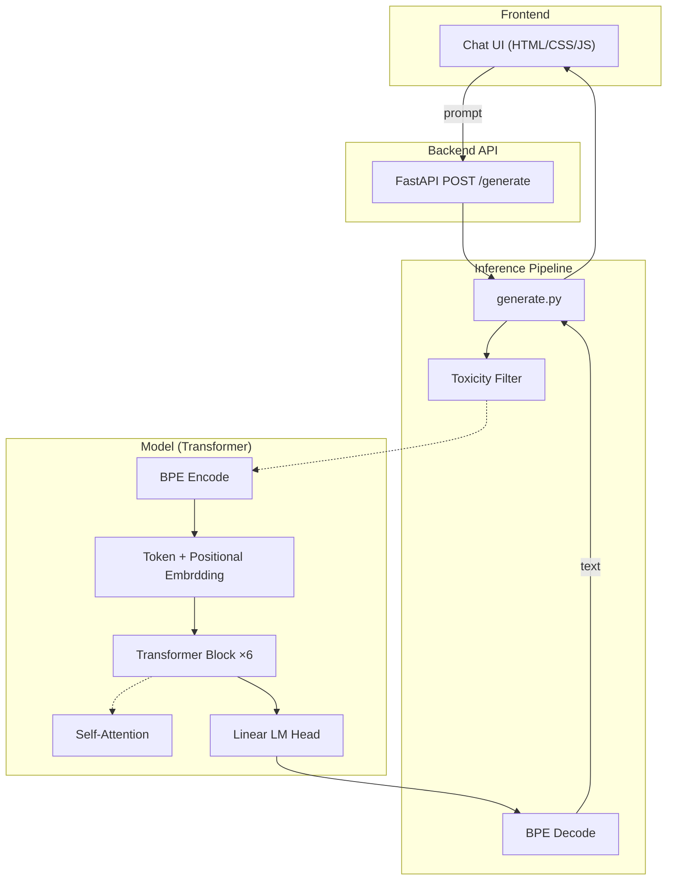

# Custom PyTorch LLM: Training to Browser UI

A complete from-scratch implementation of a Transformer Large Language Model, built entirely without calling any external model APIs.

## Architecture Highlights
- **Core Model**: Standard GPT-style decoder-only transformer mapping.
- **Tokenizer**: Custom BPE Tokenizer built from scratch.
- **Data Pipeline**: Downloads and processes WikiText-2.
- **Training**: AdamW optimizer, cosine learning rate scheduling, mixed-precision (FP16/AMP).
- **Inference**: Temperature, top-k, and nucleus (top-p) sampling parameters.
- **Safety & Speed**: Basic Toxic output filtering and CPU dynamic `qint8` quantization.
- **Full Stack**: RESTful FastAPI backend and a sleek browser-based Chat UI.

## Getting Started

1. **Install dependencies**:
   ```bash
   pip install -r requirements.txt
   ```

2. **Train the model**:
   ```bash
   python run.py --train
   ```
   *(This downloads the dataset, trains the BPE tokenizer, and trains the transformer on your GPU/CPU for 5000 steps. Default size is ~45M parameters.)*

3. **Run the API Server**:
   ```bash
   python run.py --api
   ```
   *(Runs on `http://localhost:8000`)*
   
4. **Chat Interface**:
   Simply double-click/open `frontend/index.html` in any web browser and chat with your custom model! It is fully stylized and simulates streaming output.

5. **CLI Interface**:
   ```bash
   python run.py --cli
   ```

## Folder Structure
- `model/`: The PyTorch Transformer and custom BPE Tokenizer.
- `data/`: Extractor scripts that download and process WikiText automatically.
- `training/`: Training loop with learning-rate scheduling and automated checkpointing.
- `inference/`: Generation pipelines and basic toxicity filters.
- `api/`: FastAPI server for interacting with the model remotely via Web.
- `frontend/`: Vanilla JS, CSS, and HTML codebase for a premium Chat UI.
- `logs/`, `checkpoints/`: Automatically generated state directories.

## Architecture Flow


